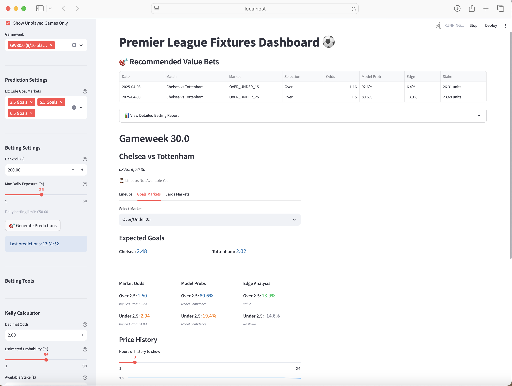

# Premier League Fixtures Dashboard ⚽

A comprehensive Streamlit application for analyzing Premier League fixtures, tracking lineups, monitoring betting odds, and generating value bet predictions.



## Overview

This dashboard provides a unified interface for Premier League match analysis and betting intelligence. It combines data from multiple sources, presents it in an intuitive UI, and offers prediction tools to identify value bets.

## Features

### Fixture Management
- **Fixture Tracking**: View all Premier League fixtures organized by gameweek
- **Lineup Integration**: Automatically scrapes and displays the latest team lineups
- **Multi-source Data**: Combines data from FBRef and Sky Sports
- **Filter System**: Filter fixtures by gameweek, completion status, and more

### Betting Tools
- **Odds Tracking**: Real-time scraping and display of betting odds from multiple markets
- **Prediction Engine**: Generates predictions for match outcomes and goals
- **Value Bet Analysis**: Identifies bets with positive expected value based on model predictions
- **Kelly Calculator**: Integrated tool for calculating optimal stake sizes
- **Bankroll Management**: Track and optimize your betting bankroll

### Dashboard Features
- **Customizable Views**: Multiple views and filtering options for fixtures
- **Auto-refresh**: Automatically updates odds and data at configurable intervals
- **Session Management**: Preserves your settings between sessions
- **Real-time Updates**: Shows lineup changes and odds movements as they happen

## Technical Components

1. **Data Scrapers**:
   - FBRef scraper for historical fixture data
   - Sky Sports scraper for lineups
   - Odds scraper for betting markets

2. **Analytics Engine**:
   - Prediction model for match outcomes
   - Value calculation for identifying overlay bets
   - Performance metrics for model evaluation

3. **UI Features**:
   - Fixture cards with detailed match information
   - Tabbed interfaces for different market types
   - Expandable sections for lineups and additional data
   - Filter controls for customized views

## Getting Started

### Prerequisites
- Python 3.8+
- Virtual environment (recommended)
- Internet connection for data updates

### Installation

1. Clone the repository:
   ```
   git clone <repository-url>
   cd Football-Betting-2025
   ```

2. Create and activate a virtual environment:
   ```
   python -m venv fb_bet_venv
   source fb_bet_venv/bin/activate  # On Windows: fb_bet_venv\Scripts\activate
   ```

3. Install dependencies:
   ```
   pip install -r requirements.txt
   ```

### Running the Dashboard

Use the provided shell script to launch the application:
```
chmod +x launch_football_app.sh
./launch_football_app.sh
```

Or run directly with Streamlit:
```
streamlit run streamlit-dashboard.py
```

## Usage Guide

1. **Initial Setup**:
   - On first run, click "Update FBRef Data" to populate fixture information
   - Use "Update Lineups Only" to fetch the latest team news

2. **Viewing Fixtures**:
   - Select gameweeks from the sidebar
   - Toggle filters for unplayed/completed matches
   - Browse fixture cards with match details, lineups, and odds

3. **Prediction System**:
   - Configure bankroll and exposure settings
   - Exclude specific goal markets if desired
   - Click "Generate Predictions" to run the prediction model
   - Review recommended value bets

4. **Odds Management**:
   - Enable auto-refresh for real-time odds updates
   - Configure the scheduler settings for update frequency
   - Monitor odds movements through the UI

## Project Structure

- `streamlit-dashboard.py`: Main application file
- `appUtils/`: Helper modules for data processing
  - `FixtureManager.py`: Handles fixture display and filtering
  - `OddsManager.py`: Manages odds data collection and display
  - `PredictionManager.py`: Generates and evaluates predictions
  - `DataLoader.py`: Loads and processes data sources
- `Data And Scripts/`: Contains data files and scraper scripts
  - `Data/`: CSV and other data files
  - Various scraper scripts for data collection
- `logs/`: Application logs (not tracked in Git)

## Maintenance

- For data updates: Use the "Update FBRef Data" button
- For lineup updates: Use the "Update Lineups Only" button
- Monitor the system status in the sidebar for health checks

## Betfair

To access live odds you will need a Betfair Account and key to access the API. Then a secrets.toml file will need to be saved in the .streamlit folder with the following info.
```
# .streamlit/secrets.toml
betfair_username = "email"
betfair_password = "password"
betfair_app_key = "key"
betfair_cert_path = "path_to/client-2048.crt"
betfair_key_path = "path_to/danielcrake/client-2048.key"
betfair_cert_path_loc = "path_to_certs"
```

## License

This project is licensed for personal use only. All rights reserved.

## Acknowledgements

- FBRef for match data
- Sky Sports for lineup information
- BetFair API for Odds Integration
- Various odds providers for betting market data
